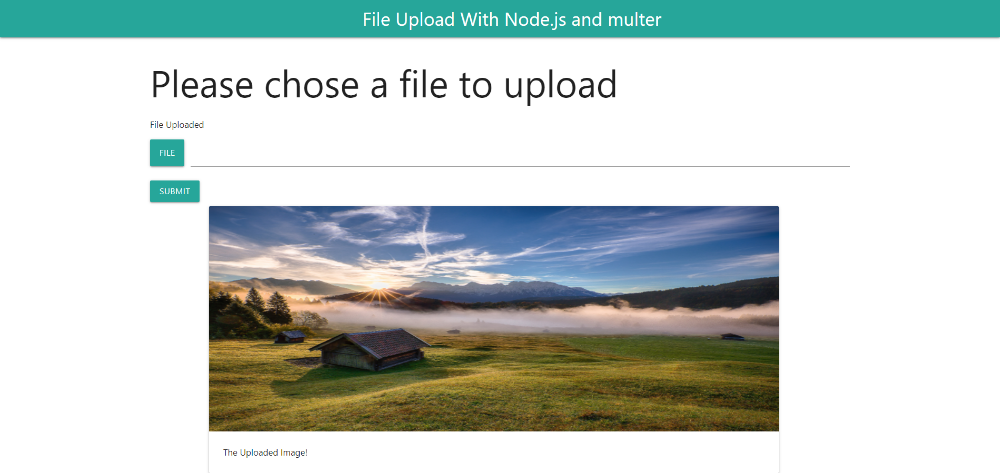

# Multer Node.js Image upload

## Server

Run `node app.js` or `nodemon` for a dev server. Navigate to `http://localhost:4200/`. 
## Upload

The uploaded images will be stored in the `upload/` directory. If any error for null or incorrect image extension an error message will be displayed.

## ScreenShots
## Home

The logo is of eve from the movie: Wall-E.
## Some Description

